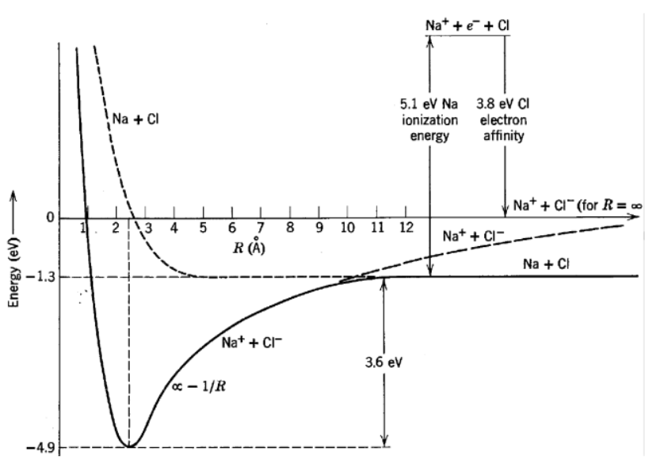

Un enlace iónico es una unión química resultante de la atracción electrostática entre iones de cargas opuestas, donde un metal cede electrones a un no metal. 

El metal pierde electrones y se convierte en *catión* con carga positiva, mientras que el no metal los gana y forma un *anión* con carga negativa, ambos alcanzando configuraciones electrónicas estables.

Se define a la *energía de ionización* como a la energía necesaria para remover un electrón de un átomo neutro y convertirlo en un catión. Remover el electrón de un catión es el proceso inverso y la energía liberada en este caso será igual a la de ionización.

Por otra parte se define la *afinidad electrónica* como la diferencia de energía del sistema al agregar un electrón a un átomo neutro y convertirlo en un anión. Para el proceso inverso, la diferencia de energía será la misma pero negativa. 

Los compuestos iónicos forman estructuras cristalinas, con propiedades como elevados puntos de fusión y solubilidad en agua, dependiendo de la fuerza de la atracción electrostática.

### Ejemplo

Una expresión fenomenológica para la energía potencial en un enlace iónico, en función de la separación $R$ entre núcleos, es la siguiente:

$$V(R) = -\frac{e^2}{4\pi\epsilon_0R} + \frac{b}{R^9}$$

Siendo $b$ un parámetro característico de cada molécula. Interpretemos físicamente que representa cada término en este potencial fenomenológico. 

Las configuraciones electrónicas de estado fundamental del $\text{Na}$ y del $\text{Cl}$ son $[\text{Ne}]3s$ y $[\text{Ne}]3s^23p^5$, respectivamente.  La separación de equilibrio de la molécula de $\text{NaCl}$ es de $2.51$ Å. Las energías de ionización del $\text{Na}$ y del $\text{Cl}$ son $5.14 \text{eV}$ eV y $13.02\text{eV}$, respectivamente y las afinidades electrónicas son $0.55\text{eV}$ y $3.72\text{eV}$, respectivamente. Hallemos también la energía necesaria para separar el $\text{Na}$ y el $\text{Cl}$ a una distancia infinita. 

Notemos el potencial esta compuesto por dos términos. Un termino atractivo, el cual va como $1/R$ y que se debe a la interacción colombiana entre los iones, los cuales tienen cargas $e$ opuestas. Por otra parte, se observa un termino repulsivo, el cual va como $1/R^9$. 

Analicemos mas a fondo este ultimo termino. Para ello, hallemos la tasa de crecimiento del potencial en función de la separación inter-nuclear:

$$ V'(R) = \frac{e^2}{4\pi\epsilon_0R^2} - \frac{9b}{R^{10}} $$
Para la separación de equilibrio $R_0$, la tasa de crecimiento del potencial será nula, teniendo en cuenta esto, podemos hallar una expresión para el termino repulsivo en función de $R_0$:

$$ V'(R_0) = 0 \Rightarrow \frac{1}{9}\frac{e^2}{4\pi\epsilon_0R_0} = \frac{b}{R_0^{9}}$$

Luego, podemos escribir el potencial, de una forma simplificada, en función de la posición de equilibrio:
$$ V(R) = -\frac{e^2}{4\pi\epsilon_0R} + \frac{b}{R_0^9} \frac{R_0^9}{R^9} = -\frac{e^2}{4\pi\epsilon_0R} + \frac{1}{9}\frac{e^2}{4\pi\epsilon_0R_0} \frac{R_0^9}{R^9} = -\frac{e^2}{4\pi\epsilon_0R}(1-\frac{R_0^8}{9R^8})$$

En la expresión hallada, puede verse que, el potencial repulsivo se vuelve despreciable para separaciones mayores a la de equilibrio, sin embargo este es el potencial dominante para separaciones menores, y es el responsable de que el potencial diverja positivamente en el origen evitando que los iones se acerquen indefinidamente.  

Supongamos ahora, que este potencial, describe el potencial del enlace de la molécula de $\text{NaCl}$, y encontremos de esta forma, la energía necesaria para separarla en los iones $\text{Na}^+$ y $\text{Cl}^-$ será:

$$ E = V(\infty) - V(R_0)= \frac{e^2}{4\pi\epsilon_0R_0}(1-\frac{R_0^8}{9R_0^8}) = \frac{8}{9}\frac{ke^2}{R_0}$$
Reemplazando:
- $e = -1.602176634 \times 10^{-19} \text{C}$
- $R_0 = 2.51 \text{Å} = 2.51 × 10^{-10} \text{m}$
- $k = \frac{1}{4\pi\epsilon_0} = 8.9875517873681764 \times 10^9 \, \text{N m}^2/\text{C}^2$

Obtenemos que la energía para separar la molécula en los iones $\text{Na}^+$ y $\text{Cl}^-$ será de:

$$ E = 5.1 \text{eV} $$

El $\text{Cl}$ tiene una configuración electrónica $[\text{Ne}]3s^23p^5$, lo que indica que tiene 7 electrones de valencia. La afinidad electrónica del $\text{Cl}$ es de $3.72\text{eV}$, es decir al agregar un electrón de valencia al $\text{Cl}$, la energía del sistema disminuye en $3.72\text{eV}$, haciendo que el $\text{Cl}$ alcance la configuración electrónica del gas noble $\text{Ar}$. Luego la energía necesaria para remover un electrón del ion de $\text{Cl}^-$ será de $3.72\text{eV}$. 

El $\text{Na}$ tiene una configuración electrónica $[\text{Ne}]3s$, lo que indica que tiene un electrón de valencia en su capa $3s$. La energía de ionización del $\text{Na}$ es de $5.14\text{eV}$, lo que significa que se necesitan $5.14\text{eV}$ para remover el electrón de valencia, haciendo que el $\text{Na}$ alcance la configuración electrónica del gas noble $\text{Ne}$. Luego, cuando el ion $\text{Na}^+$ capta un electrón, la energía del sistema disminuye en $5.14\text{eV}$.

Finalmente podemos hallar la energía, necesaria para separar el $\text{NaCl}$ en $\text{Na}$ y $\text{Cl}$.

$$ \text{Na}^+\text{Cl}^- \rightarrow \text{Na}^+ + \text{Cl}^- \qquad E = 5.1 \text{eV}$$

$$ \text{Cl}^- \rightarrow \text{Cl} + e^- \qquad \Delta E = 3.72\text{eV}$$

$$ \text{Na}^+ + e^- \rightarrow \text{Na} \qquad \Delta E = -5.14 \text{eV} $$

$$ \Rightarrow \text{Na}^+\text{Cl}^- \rightarrow \text{Na} + \text{Cl} \qquad E = 5.1 \text{eV} + 3.72 \text{eV} - 5.14 \text{eV} = 3.68 \text{eV}$$

Finalmente la energía de disociación del $\text{NaCl}$ será de $E = 3.68\text{eV}$.El proceso puede verse mas claramente en el siguiente diagrama:

### Ejemplo

Una expresión fenomenológica para la energía potencial de un molécula de haluro alcalino tiene la siguiente forma:
$$ V(R) = \alpha \exp(-aR) - \frac{e^2}{4\pi \epsilon_0 R}$$

Datos espectrales proveen valores de la separación de equilibrio $R_0 = 1.56 \text{Å}$ y de la curvatura de la energía potencial $K = \frac{d^2V}{dR^2}|_{R=R_0} = 248 \text{J/m}^2$, para la molécula $\text{LiF}$.  Por otra parte es sabido que la energía de ionización del $\text{Li}$ es $5.4 \text{eV}$ y la afinidad electrónica del $\text{F}$ es $3.4 \text{eV}$.

Hallemos la energía para separar la molécula $\text{LiF}$ en los iones $\text{Li}^+$ y $\text{F}^-$ a distancia infinita y la energía de disociación de la molécula $\text{LiF}$.  

La energía necesaria para separar la molécula será:

$$ E = V(\infty) - V(R_0) = - \alpha \exp(-aR_0) + \frac{e^2}{4\pi \epsilon_0 R_0}$$
Debemos expresar $E$ en términos de la separación de equilibrio $R_0$ y la curvatura de la energía potencial $K$. Para ello derivamos la expresión del potencial:

$$ V'(R) = -\alpha a \exp(-aR) + \frac{e^2}{4\pi\epsilon_0R^2} \qquad V''(R) = \alpha a^2 \exp(-aR) - \frac{e^2}{2\pi\epsilon_0 R^3} $$
Para la separación de equilibrio $R_0$ se verifica que:
$$ V'(R_0) = 0 \Rightarrow \alpha a \exp(-aR_0) = \frac{e^2}{4\pi\epsilon_0R_0^2} $$
Si bien no existe una expresión cerrada de la separación de equilibrio $R_0$, podemos usar esta expresión para escribir la expresión de la curvatura $K$ como:

$$ K = V''(R_0) = a \frac{e^2}{4\pi\epsilon_0 R_0^2} - \frac{e^2}{2\pi\epsilon_0R_0^3} = \frac{e^2}{4\pi\epsilon_0R_0^3}(aR_0 -2)$$
Luego el parámetro $a$ en términos de $K$ y $R_0$ será:
$$ \Rightarrow a = \frac{1}{R_0} \left(\frac{R_0^3}{ke^2}K + 2 \right)$$
Reemplazando en la energía $E$:

$$ E = - \frac{1}{a} \frac{e^2}{4\pi\epsilon_0R_0^2} + \frac{e^2}{4\pi\epsilon_0R_0} =  \frac{ke^2}{R_0^2} (1 - \frac{1}{aR_0}) $$

$$ E = \frac{ke^2}{R_0^2}\left(1 - \frac{1}{K R_0^3 / ke^2 + 2}\right)$$
Reemplazando:
* $k = 8.9876\times 10^9 \, \text{N m}^2/\text{C}^2$
* $e = 1.602176634 \times 10^{-19} \text{C}$.
* $R_0 = 1.56 \times 10^{-10} \text{m}$
* $K = 248 \text{J/m}^2$

Finalmente podemos analizar el proceso de disociación del $\text{Li}^+\text{F}^-$ y $\text{Li}$ y $\text{F}$. 
 
$$ \text{Li}^+\text{F}^- \rightarrow \text{Li}^+ + \text{F}^-  \qquad  E = 6.7 \text{eV} $$

$$ F^- \rightarrow F + \text{}e^- \qquad \Delta E = 3.4\text{eV}$$

$$ \text{Li}^+ + e^- \rightarrow \text{Li} \qquad \Delta E = -5,4\text{eV} $$

$$ 
\Rightarrow \text{Li}^+\text{F}^- \rightarrow \text{Li} + \text{F} \qquad E = 6.7 \text{eV} + 3.4 \text{eV}  - 5.4\text{eV} = 4.7 \text{eV}
$$

Finalmente la energía de disociación del $\text{LiF}$ será de $E = 4.7 \text{eV}$.