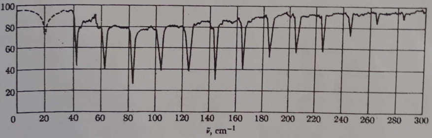
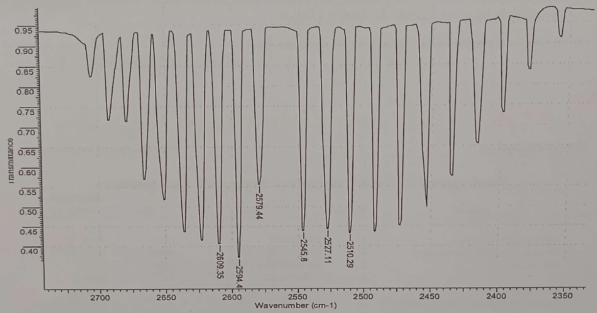
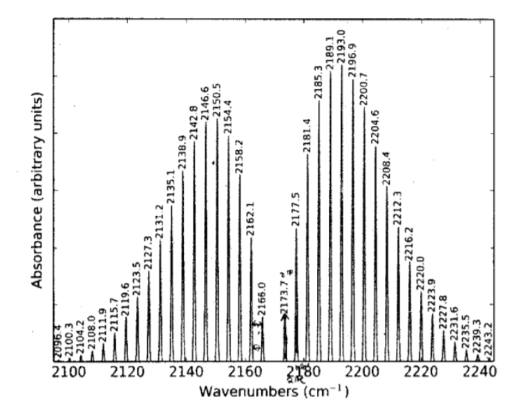

Una molécula moviéndose libremente en el espacio puede experimentar tres tipos de movimiento fundamentales: traslación, rotación y vibración.

Supongamos una molécula con posición $\vec{R}_{CM}$, una distancia inter-nuclear $\vec{R}$ y masa reducida $\mu$.  Bajo esta descripción podemos se puede desacoplar el movimiento de una molécula en dos grupos:

- El movimiento de su centro de masa.
- Los movimientos con respecto a su centro de masa.

Para un sistema de muchas moléculas se puede estudiar el primer grupo bajo el marco de la mecánica estadística. Por el momento nos interesa el segundo grupo.

Escribamos el hamiltoniano de una molécula con respecto a su centro de masa en coordenadas esféricas en términos del operador momento angular $\vec{L}$.

$$
\hat{H} = -\frac{\hbar^2}{2\mu}\left(\frac{1}{R^2} \frac{\partial}{\partial R}(R^2\frac{\partial}{\partial R}) - \frac{1}{R^2}\frac{\hat{L}^2}{\hbar^2} \right) + \hat{V}
$$
Con $\hat{V}$ un potencial, el cual por simplicidad suponemos que solo depende de $R$. Luego los autoestados de dicho hamiltoniano $\ket{\psi}$ pueden escribirse en términos de una parte radial y los autoestados del operador $\hat{L}^2$, es decir los armónicos esféricos. Esto nos indica que una molécula puede tanto vibrar como rotar.  

Para moléculas estables, sabemos que una separación inter-nuclear de equilibrio existe, supongamos por el momento las vibraciones pueden considerarse oscilaciones pequeñas al rededor de esta, es decir $R \approx R_0$. Bajo esta aproximación podemos desacoplar el movimiento vibracional del movimiento de rotacional de la molécula, es decir considerarlos independientes. Escribimos los hamiltonianos para cada uno:

$$ \hat{H}_{rot} \approx \frac{\hat{L}^2}{2\mu R_0^2} \qquad
\hat{H}_{vib} \approx   -\frac{\hbar^2}{2\mu} \frac{1}{R^2} \frac{\partial}{\partial R}(R^2\frac{\partial}{\partial R}) + \hat{V}
$$
Con $R$ el modulo de $\vec{R}$. Luego el hamiltoniano de una molécula simplemente será $\hat{H} = \hat{H}_{rot} + \hat{H}_{vib}$. Notemos que el hamiltoniano de rotación tendrá autoestados de la forma $\ket{\psi} \sim \ket{l, m}$ con auto-energías:

$$E^l_{rot} = \frac{\hbar^2l(l+1)}{2\mu R_0^2} \quad l = 0, 1, 2, ...$$

Para el caso vibracional, se puede reducir la dimensión de la ecuación de Schrödinger  tomando ecuaciones de onda de la forma $\frac{U(R)}{R}$, es decir:

$$
\psi(\vec{R}) \sim \frac{U(R)}{R} \Rightarrow \hat{H}_{vib} \psi(\vec{R})  = -\frac{\hbar^2}{2\mu}\frac{\partial^2}{\partial^2R}\psi(\vec{R})  + V(R)
$$

Si desarrollamos $V(R)$ hasta segundo orden, al rededor de la posición de equilibrio $R_0$:

$$ V(R) \approx V(R_0) + \frac{1}{2}V''(R_0)(R-R_0)^2$$

El hamiltoniano $\hat{H}_v$ se transforma en el hamiltoniano del oscilador armónico desplazado. Teniendo en cuenta que la energía cinética es invariante ante translaciones, hacemos el reemplazo de variables $R - R_0 \equiv r$ y escribimos:

$$ \hat{H}_{vib} \psi(\vec{r}) \approx -\frac{\hbar^2}{2\mu} \frac{\partial}{\partial r^2} \psi(\vec{r}) + \frac{1}{2}kr^2\psi(\vec{r}) = (E_{vib} - V(R_0))\psi(\vec{r})$$

Las auto-energías de esta ecuación son las del oscilador armónico, las cuales son bien conocidas y las podemos escribir como:

$$ E_{vib}^v =V(R_0)+ \hbar\omega(v + \frac{1}{2}) \qquad v = 0, 1, 2, ...$$

Finalmente la energía de la molécula será simplemente igual a la suma de las energías rotacional y vibracional y podemos describir el espectro de energías roto-vibracional de una molécula como:

$$
E^{v,l} = V(R_0 ) + \hbar \omega(v + \frac{1}{2}) + \frac{\hbar^2l(l+1)}{2\mu R_0^2} \quad v=0,1,2 ... \quad l = 0,1,2 ...
$$

En donde $\omega^2 = \frac{k}{\mu}$  con $k \equiv V''(R_0)$ para algún potencial $V(R)$ que que describa la interacción entre átomos en la molécula. 

### Ejemplos

#### Energía rotacional del $\text{CO}$

Calculemos la energía **rotacional** de los tres primeros niveles rotacionales puros molécula $\text{CO}$. Determinemos también la longitud de onda de los fotones absorbidos en las transiciones entre estos niveles de energía. La longitud de enlace de la molécula es $1,13\text{Å}$

Los niveles de energía rotacionales para el $\text{CO}$ serán:

$$ E_{rotacional}^l = \frac{\hbar^2l(l+1)}{2\mu R_0^2} \qquad l = 1,2,... \qquad \mu \frac{1}{\frac{1}{m_{\text{C}} } + \frac{1}{m_{\text{O}} }}$$

Reemplazando para $l = 0, 1, 2$:
- $R_0 = 1,13\text{Å}$
- $m_H \approx m_p \approx 1,6726 \times 10^{−27} \text{kg}$
- $m_C \approx 12 m_H$
- $m_O \approx 16 m_H$

Obtenemos las energías: $E_{rot}^0 = 0$,  $E_{rot}^1 = 0.46 \text{meV}$ y $E_{rot}^2 = 1.42 \text{meV}$. Para realizar transiciones entre estos niveles la molécula necesita absorber energía la cual se transporta a través de fotones. La energía necesaria para una transición que la molécula realice la transición $l \rightarrow l + 1$ será:

$$ 
\Delta E^l = E^{l+1} - E^l  = \frac{\hbar^2}{2\mu R_0^2}[(l+1)(l+2) -l(l+1)] = \frac{\hbar^2}{2\mu R_0^2}(l+1)
$$

Por otra parte la energía de un fotón depende de su longitud de onda de la forma:

$$ E_{\gamma} = h \nu = \frac{hc}{\lambda}$$

Finalmente podemos hallar la longitud de onda de los fotones absorbidos en estas transiciones, igualando la energía necesaria para la transición con la energía del fotón.

$$ \frac{hc}{\lambda_l} = \Delta E^l \Rightarrow \lambda_l = \frac{hc}{\Delta E^l}$$

Obteniéndose que los fotones absorbidos tendrán longitud de onda $\lambda_0 = 2.68 \text{mm}$ y $\lambda_1 = 128 \text{mm}$.  

#### Espectro rotacional del $\text{HCl}$.

La separación entre líneas del espectro rotacional puro de $\text{HCl}$ es $6,35×10^{11} \text{Hz}$. Determinemos la separación inter-nuclear de esta molécula.

Cuando hablamos de separación entre líneas en un espectro rotacional, nos referimos en realidad a los valores de energía para los cuales hubo una transición de energía, es decir, la molécula absorbió una cantidad $\Delta E$ de energía y paso a un estado rotacional con un numero cuántico $l$ mayor al que tenia. Estos son los niveles de energía que serán medidos y la separación entre estos puede expresarse como:

$$ \Delta E^l = E^{l+1} - E^{l} = \frac{\hbar^2}{2\mu R_0^2}[(l+1)(l+2) -l(l+1)] = \frac{\hbar^2}{\mu R_0^2}(l+1)$$

Puede verse que la separación entre dos de estas líneas será constante igual a:

$$ h \nu = \frac{\hbar^2}{\mu R_0^2}$$
Luego la separación inter-nuclear de la molécula puede expresarse simplemente como:  

$$ R_0 = \sqrt{\frac{\hbar}{2\pi\mu\nu}} \qquad \mu = \frac{1}{\frac{1}{m_{\text{H}} } + \frac{1}{m_{\text{Cl}} }} \approx m_H$$

Finalmente reemplazando:
- $\nu = 6,35×10^{11} \text{s}^{-1}$
- $m_H \approx 1.00784 \times 931.5 \text{MeV}/c^2$ 
- $\hbar = 4.135 \text{eV}\cdot s$

Obtenemos que la separación inter-nuclear de equilibrio será de $R_0 \approx 1.27 \text{Å}$.

#### Potencial de Morse

Para muchas moléculas ligadas covalentemente, la energía potencial se puede describir adecuadamente por medio del potencial de Morse:

$$ V(R) = A \left( e^{-2a(R-R_0)} - 2e^{-a(R-R_0)} \right) $$

Donde $A$, $a$ y $R_0$ son parámetros característicos de cada molécula. La separación inter-nuclear de la molécula $\text{CO}$ es $0.113 \text{nm}$, la energía de disociación es de $9.60 \text{eV}$, la frecuencia vibracional es de $6.51 \times 10^{13} \text{Hz}$. A partir de estos datos experimentales, determinar los potenciales de Morse para la interacción entre el carbono y el oxígeno.

La energía de disociación de una molécula diatómica es la energía necesaria para separar los átomos a una distancia infinita, es decir:

$$ 
\Delta E = V(\infty) - V(R_0) = 0 - V(R_0) = A = 9.60 \text{eV}
$$

Hallemos ahora el parámetro $a$. Derivamos el potencial de Morse:

$$ 
V'(R) = A \left( -2a e^{-2a(R-R_0)} + 2ae^{-a(R-R_0)} \right) \qquad V''(R) = A \left( 4a^2 e^{-2a(R-R_0)} - 2a^2 e^{-a(R-R_0)} \right) 
$$

Es inmediato que $V'(R_0) = 0$. Desarrollando a segundo orden alrededor de $R_0$, podemos aproximar el potencial de Morse como un oscilador armónico:

$$ 
V(R) \approx V(R_0) + \frac{1}{2} V''(R_0)(R - R_0)^2 \qquad k = \omega^2 \mu 
$$

En donde:

$$ 
V(R_0) = -A \qquad k = V''(R_0) = A \left( 4a^2 e^{-2a(R_0-R_0)} - 2a^2 e^{-a(R_0-R_0)} \right) = 2Aa^2
$$

Reemplazando en $k = \omega^2 \mu$:

$$ 
\omega^2 \mu = 2\epsilon a^2 \Rightarrow a = \sqrt{\frac{\omega^2 \mu}{2\epsilon}} 
$$

En donde habíamos encontrado que $A$ es la energía de disociación. Reemplazando:
- $A = 9.60 \text{eV}$
- $\nu = \omega / 2\pi = 6.51 \times 10^{13} \text{Hz}$

Obtenemos finalmente que $a = 2.49 \text{Å}^{-1}$.

## Reglas de transición

### Ejemplo

La siguiente figura muestra un espectro de absorción de la molécula de $\text{HCl}$ en fase gaseosa, en función del numero de onda $\bar{\nu} = \frac{1}{\lambda}$, siendo $\lambda$ la longitud de onda de la radiación electromagnética en $\text{cm}$. 

Consideremos que esta molécula está formada por los isótopos $^1\text{H}$ y $^{35}\text{Cl}$ con masas atómicas $1.007825\text{u}$ y $34.968853\text{u}$ respectivamente.

Expliquemos el origen de estas líneas de absorción y la forma espectral de estas. 

### Ejemplo

La figura muestra un espectro de absorción de la molécula de bromuro de hidrógeno $\text{HBr}$ en fase gaseosa, en función del número de onda $\bar{\nu} = \frac{1}{\lambda}$, siendo $\lambda$ la longitud de onda de la radiación electromagnética expresada en $\text{cm}$.

  

Las masas atómicas de los elementos bromo e hidrógeno son $m_{\text{Br}} = 79.909 \, \text{u}$ y $m_{\text{H}} = 1.00784 \, \text{u}$, respectivamente. A continuación:

- Explicaremos la forma espectral medida en relación a la posición de las líneas de absorción observadas. Realizar un diagrama indicando las transiciones entre los niveles de energía correspondientes para las líneas espectrales comprendidas entre $2510\text{cm}^{-1}$ y $2610\text{cm}^{-1}$.
- Estimaremos la separación inter-nuclear de la molécula $\text{HBr}$ en su estado fundamental.
- Estimaremos la energía de punto cero de la molécula $\text{HBr}$.

### Ejemplo

