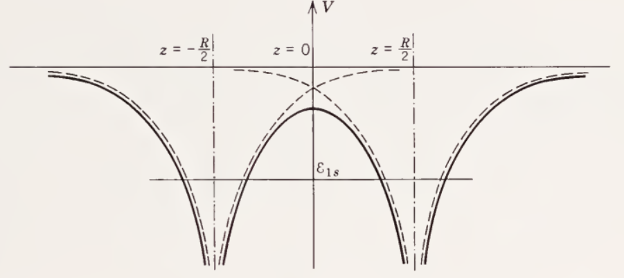
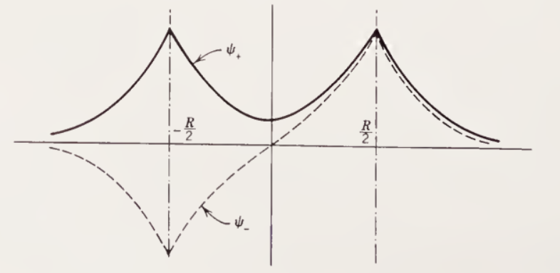
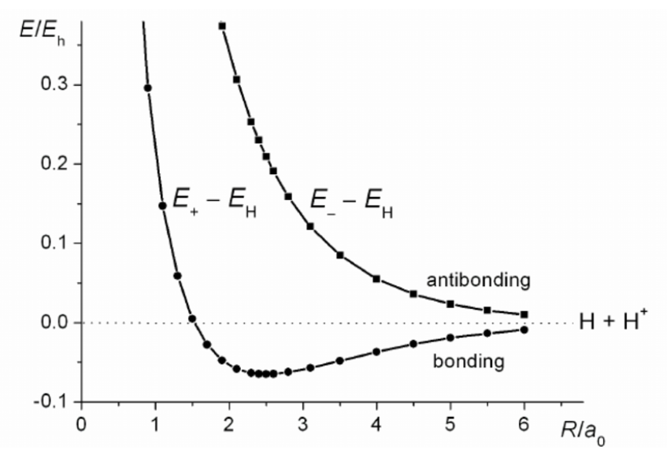

Las moléculas son una colección de dos o más núcleos y sus electrones asociados. Resolver la estructura molecular es un problema complejo, por ello se aborda el estudio de las moléculas partiendo de sistemas atómicos simples como la molécula de hidrogeno.
### Aproximación de Born Oppenheimer

La aproximación de Born-Oppenheimer es una hipótesis de carácter fundamental en la que se basan la mayor parte de los cálculos de la física molecular. 

Esta hipótesis se basa en que *los núcleos de los átomos son mucho más pesados y se mueven más lentamente que los electrones*. Dicho esto, los núcleos se pueden considerar fijos en una posición y los electrones se pueden considerar moviéndose con respecto a estos.
### El ion de $\text{H}_2^+$

Supongamos un arreglo de dos átomos centrados en $R/2$ y $-R/2$ respectivamente, con una carga positiva en cada núcleo y un solo electrón en la nube electrónica.

Bajo la aproximación de Born-Oppenheimer podemos escribir el hamiltoniano de dicho sistema como:

$$
\hat{H}_{\text{H}_2^+} = -\frac{\hbar^2}{2m_e} \nabla_{\vec{r}}^2 - \frac{ke^2}{|\vec{r} - \vec{R}/2|} - \frac{ke^2}{|\vec{r} + \vec{R}/2|} + \frac{ke^2}{|\vec{R}|}
$$
En la siguiente figura se puede observar un esquema del potencial expresado en el hamiltoniano anterior. A medida la separación inter-nuclear disminuye, la forma del potencial difiere cada vez mas a la del potencial resultante de considerar los núcleos por separado.  

Sea $\psi$ un auto-estado de este hamiltoniano. Debido a la simetría del problema, se espera que la probabilidad de encontrar a un electrón en proximidad al núcleo centrado en $\vec{R}/2$, sea la misma que encontrarlo en $-\vec{R}/2$, por lo que:

$$
|\psi(\vec{r})|^2 = |\psi(-\vec{r})|^2 \Rightarrow \psi(\vec{r}) = \pm \psi(-\vec{r})
$$

Esto es, *la función de onda electrónica del ion $\text{H}_2^+$ tiene paridad definida*.  Veamos que implicancias tiene esto. Sea $\phi_{1s}$ el estado fundamental un núcleo centrado en el origen, es decir una auto-estado del hamiltoniano $\hat{H}_{\text{H}}$. 

$$
\hat{H}_{\text{H}} \ket{\phi_{1s}} = E_{1s}\ket{\phi_{1s}}
$$

Notemos que podemos aplicar los operadores translación $\hat{T}_{\vec{R}/2}$ y $\hat{T}_{-\vec{R}/2}$ a ambos miembros de la ecuación, y obtenemos los hamiltonianos de interacción de los núcleos del ion de hidrogeno y su electrón. En ambos casos la energía cinética será la misma, ya que el operador translación no tiene efecto en esta. Dicho esto y teniendo en cuenta la paridad la función de onda, proponemos soluciones:

$$
\ket{\psi_{\pm}} \sim \hat{T}_{-\vec{R}/2} \ket{\phi_{1s}} \pm \hat{T}_{\vec{R}/2} \ket{\phi_{1s}} \equiv \ket{\phi_a} \pm \ket{\phi_b} \qquad \hat{H}_{\text{H}_2^+} \equiv \hat{K} + \hat{V}_a + \hat{V}_b + \hat{V}_R
$$

La solución $\psi_-$ se denomina *estado anti-ligante* ya que contiene un nodo (región con densidad electrónica nula) entre los núcleos, y desestabiliza la molécula si esta ocupado.  Por el contrario el estado $\psi_+$ se denomina ligante, ya que estabiliza la molécula. 

En la siguiente figura se pueden observar los estados ligante y anti-ligante de la molécula. Nótese el nodo en el origen.

Buscamos ahora aproximar las auto-energías del estado fundamental del ion de hidrogeno $H_2^+$. Para ambos estados, esta estará dada por:

$$
E_{\pm} = \frac{\langle \psi_{\pm} | \hat{H} | \psi_{\pm} \rangle}{\langle \psi_{\pm} \ket{\psi_{\pm}}} = \frac{(\bra{\phi_a} \pm \bra{\phi_b}) | \hat{K} + \hat{V}_a + \hat{V}_b + \hat{V}_R | (\ket{\phi_a} \pm \ket{\phi_b})}{(\bra{\phi_a} \pm \bra{\phi_b})  (\ket{\phi_a} \pm \ket{\phi_b})}
$$

$$
\begin{aligned}
c^2_{\pm} E_{\pm} = \bra{\phi_a} \hat{K} + \hat{V}_a \ket{\phi_a} + \bra{\phi_a} \hat{V}_b + \hat{V}_R \ket{\phi_a} \\ 
+ \bra{\phi_b} \hat{K} + \hat{V}_b \ket{\phi_b} + \bra{\phi_b} \hat{V}_a + \hat{V}_R \ket{\phi_b} \\
\pm \bra{\phi_a} \hat{K} + \hat{V}_b \ket{\phi_b} \pm \bra{\phi_a} \hat{V}_a + \hat{V}_R \ket{\phi_b} \\ 
\pm \bra{\phi_b} \hat{K} + \hat{V}_a \ket{\phi_a} + \bra{\phi_b} \hat{V}_b + \hat{V}_R \ket{\phi_a}
\end{aligned}
$$

En donde podemos hallar el termino de normalización $c_{\pm}$ como:

$$
c_{\pm}^2 = (\bra{\phi_a} \pm \bra{\phi_b})  (\ket{\phi_a} \pm \ket{\phi_b}) = 2 \pm 2\langle  \phi_a\ket{\phi_b} \equiv 2 + 2S
$$

Luego, identificando en los términos agrupados con los del hamiltoniano del átomo de hidrogeno, podemos reemplazar:

$$
\bra{\phi_a} \hat{K} + \hat{V}_a \ket{\phi_a} = \bra{\phi_b} \hat{K} + \hat{V}_b \ket{\phi_a} = E_{1s}
$$

$$
\bra{\phi_a} \hat{K} + \hat{V}_b \ket{\phi_b} = \bra{\phi_b} \hat{K} + \hat{V}_a \ket{\phi_a} = E_{1s} S
$$

$$
\bra{\phi_a} \hat{V}_R \ket{\phi_a} = \bra{\phi_b} \hat{V}_R \ket{\phi_b} = V_R
$$

$$
\bra{\phi_a} \hat{V}_R \ket{\phi_b} = \bra{\phi_b} \hat{V}_R \ket{\phi_a} = V_RS
$$

Finalmente las energías para el estado fundamental, bajo la aproximación de Born-Oppenheimer serán:

$$
E_{\pm} = E_{1s} + V_R - ke^2\frac{M}{1 \pm S} \mp ke^2\frac{N}{1 \pm S}
$$

En donde $S$, $M$ y $N$ son las contantes de solapamiento, de coulomb y resonancia respectivamente dadas por las integrales:

$$
S \equiv \int_{\mathbb{R}^3} \phi_{1s}(\vec{r}+\vec{R}/2)  \phi_{1s}(\vec{r}-\vec{R}/2)  d^3\vec{r} = \langle \phi_a \ket{\phi_b}
$$

$$
M \equiv \int_{\mathbb{R}^3} \frac{\phi_{1s}(\vec{r}-\vec{R}/2)^2}{|\vec{r}+\vec{R}/2|} d^3 \vec{r}  = -ke^2 \bra{\phi_a} \hat{V}_b \ket{\phi_a} =  -\frac{1}{ke^2} \bra{\phi_b} \hat{V}_a \ket{\phi_b} 
$$

$$
N \equiv \int_{\mathbb{R}^3} \frac{\phi_{1s}(\vec{r}+\vec{R}/2) \phi_{1s}(\vec{r}-\vec{R}/2)}{|\vec{r}+\vec{R}/2|} d^3 \vec{r} =  -\frac{1}{ke^2} \bra{\phi_b} \hat{V}_b \ket{\phi_a} =  -\frac{1}{ke^2}  \bra{\phi_a} \hat{V}_a \ket{\phi_b} 
$$

Para evaluar las integrales, en este problema es conveniente hacer uso de coordenadas elipsoidales $(u,v,\phi)$:

$$u = \frac{r_a + r_b}{R}, \quad v = \frac{r_a - r_b}{R}, \quad dV = \frac{1}{8}R^3(u^2 - v^2)dudvd\phi$$

Con $1 \leq u < \infty$, $-1 \leq v \leq 1$ y $0 \leq \phi \leq 2\pi$, $dV$ es el elemento de volumen y $r_a$ y $r_b$ son las distancias desde cada uno de los protones al electrón:

$$ r_a = |\vec{r} + \vec{R}/2| = \frac{R}{2}(u+v) \qquad r_b = |\vec{r} - \vec{R}/2| = \frac{R}{2}(u-v)$$

Reemplazando en la función de onda para los núcleos de hidrogeno:

$$\phi_{1s}(r_a) = \frac{1}{\sqrt{\pi a_0^3}} e^{-r_a/a_0} = \frac{1}{\sqrt{\pi a_0^3}} e^{-(u+v)R/2a_0} \qquad \phi_{1s}(r_b) = \frac{1}{\sqrt{\pi a_0^3}} e^{-r_b/a_0} = \frac{1}{\sqrt{\pi a_0^3}} e^{-(u-v)R/2a_0} $$

Reemplazando en la integral de solapamiento $S$:

$$ S = \frac{R^3}{8\pi a_0^3} \int_0^{2\pi}\int_1^{\infty}\int_{-1}^1 e^{-(u+v)R/2a_0} e^{-(u-v)R/2a_0} (u^2-v^2) dudvd\phi$$

$$ = \frac{R^3}{4a_0^3} ( \int_1^{\infty} e^{-\alpha u}u^2du\int_{-1}^1 dv - \int_{1}^{\infty}e^{-\alpha u}du \int_{-1}^{1}v^2dv)$$

$$= \frac{R^3}{4a_0^3}(2 \frac{d^2}{d\alpha^2}  \int_1^{\infty} e^{-\alpha u}du - \frac{2}{3}\int_1^{\infty}e^{-\alpha u}du) = \frac{R^3}{2a_0^3} (\frac{d^2}{d \alpha^2} \frac{e^{-\alpha}}{\alpha} - \frac{1}{3}\frac{e^{-\alpha}}{\alpha})$$

$$ = \frac{R^3}{2a_0^3}e^{-\alpha}(\frac{\alpha^2 + 2\alpha + 2}{\alpha^3} - \frac{\alpha^2}{3\alpha^3}) = \frac{R^3}{a_0^3} \frac{e^{-\alpha}}{\alpha^3}(\frac{1}{3}\alpha^2 + \alpha + 1)$$

$$ S = e^{-R/a_0} (1 + \frac{R}{a_0} + \frac{R^2}{3a_0^2})$$
La integral de Coulomb $M$:

$$ M =  \frac{R^3}{8\pi a_0^3} \int_0^{2\pi}\int_1^{\infty}\int_{-1}^1 \frac{e^{-(u-v)R/a_0}}{R(u+v)/2} (u^2-v^2)dudvd\phi$$

$$ = \frac{R^2}{2a_0^3} \int_1^{\infty}\int_{-1}^1 e^{-uR/a_0} e^{vRa_0}(u-v)dudv = -\frac{R^2}{2a_0^3} \frac{d}{d\alpha} \int_{1}^\infty e^{-\alpha u} \int_{-1}^1 e^{\alpha v} dvdu $$

$$ = -\frac{R^2}{2a_0^3} \frac{d}{d\alpha} \frac{1 - e^{-2\alpha}}{\alpha^2} = - \frac{\alpha^3 e^{-2\alpha}}{2R}(\frac{2\alpha - 2e^{2\alpha} + 2}{\alpha^3})$$

$$ M = \frac{1}{R} - (\frac{1}{R} +{\frac{1}{a_0})e^{-2R/a_0}}$$

Y finalmente la integral de resonancia $N$:

$$ N =  \frac{R^3}{8\pi a_0^3} \int_0^{2\pi}\int_1^{\infty}\int_{-1}^1 \frac{e^{-uR/a_0}}{R(u+v)/2} (u^2-v^2)dudvd\phi$$

$$ = \frac{R^2}{2a_0^3} \int_0^{\infty}\int_{-1}^1 e^{-\alpha u} (u - v) dudv = - \frac{R^2}{2a_0^3} (\frac{d}{d\alpha}\int_0^{\infty} e^{-\alpha u} du \int_{-1}^{1} dv - \int_0^{\infty}e^{-\alpha u} du \int_{-1}^1vdv)$$

$$ = - \frac{R^2}{2a_0^3} e^{-\alpha} \left( - \frac{2}{\alpha} - \frac{2}{\alpha^2}  \right) = \frac{\alpha^2}{R}e^{-\alpha}(1 + \frac{1}{\alpha})$$

$$ N = \frac{1}{a_0}e^{-R/a_0}\left(1 + \frac{R}{a_0}\right)$$

En la siguiente figura se pueden observar las energías del estado ligado y anti-ligado del ion de hidrogeno $\text{H}_2^+$.  

Nótese que los estados ligados **minimizan la energía** de la molécula y poseen una región de estabilidad, cosa de la cual carecen los estados anti-ligados. 

Esto nos permite definir los _orbitales enlazantes_ $\sigma_{1s}$ como aquellos en los cuales los estados $\ket{\psi_{\sigma_{1s}}}$ incrementan la densidad electrónica entre los núcleos de los átomos enlazados, en contraste con los _orbitales anti-enlazantes_ $\sigma_{1s}^*$,  correspondientes a los estados anti-ligantes $\ket{\psi_{\sigma_{1s}^*}}$, que tienden a desestabilizar la molécula debido a que la disminución de la densidad electrónica entre los núcleos crea una repulsión que debilita el enlace.
### La molécula de $\text{H}_2$ 

Consideremos ahora la molécula de hidrogeno $\text{H}_2$, la cual, a diferencia del ion $\text{H}_2^+$, contiene dos electrones en lugar de uno.  Habíamos visto que para el ion $\text{H}_2^+$, podíamos escribir el hamiltoniano del electrón como:

$$
\hat{H}_{\text{H}_2^+} = -\frac{\hbar}{2m_e} \nabla_{\vec{r}_e}^2 - \frac{ke^2}{|\vec{r}_e - \vec{R}/2|} - \frac{ke^2}{|\vec{r}_e + \vec{R}/2|} + \frac{ke^2}{|\vec{R}|}
$$

Esto es, la energía cinética del electrón, mas la interacción de los núcleos con este, mas la interacción entre núcleos.  Notemos que esta definición puede extenderse al caso de dos electrones de manera sencilla, si $\hat{H}^{(1)}_{\text{H}_2^+}$ y  $\hat{H}^{(2)}_{\text{H}_2^+}$ son los hamiltonianos para los electrones $1$ y $2$ de la molécula, entonces el hamiltoniano de la molécula  de $\text{H}_2$ será:

$$\hat{H}_{\text{H}_2} =   \hat{H}^{(1)}_{\text{H}_2^+} +  \hat{H}^{(2)}_{\text{H}_2^+} - \frac{ke^2}{|\vec{R}|} +\frac{ke^2}{|\vec{r}_1 - \vec{r}_2|}$$

En donde se resta el termino interacción entre los núcleos para evitar sumarlo dos veces, y se añade un termino de interacción entre ambos electrones. Buscamos ahora describir los estados de baja energía de la molécula.

Supongamos, a primera instancia, que hay exactamente un electrón en la cercanía de cada protón de la molécula. Esto se conoce como *la aproximación de Heitler-London* y describe la formación del enlace covalente en la molécula de $\text{H}_2$. Al igual que con el ion de hidrogeno $\text{H}_2^+$ podemos describir los estados electrónicos de la molécula de $\text{H}_2$ mediante orbitales $\phi_{1s}$ como:

$$ \ket{\psi} \sim \hat{T}_{-\vec{R}/2}\ket{\phi_{1s}} \otimes \hat{T}_{\vec{R}/2}\ket{\phi_{1s}} \equiv \ket{\phi_a, \phi_b}$$

Debemos también considerar los espines $\ket{s_1,}$ y $\ket{s_2}$ de los electrones, es decir:

$$ \ket{\psi} \sim \ket{s_1} \otimes \ket{s_2} \equiv \ket{s_1, s_2}$$

Como hablamos de fermiones, la función de onda debe ser anti-simétrica ante el intercambio de partículas, es decir $\langle \vec{r}_1 , \vec{r}_2 \ket{\psi} = \langle \vec{r}_2 , \vec{r}_1 \ket{\psi}$, considerando un termino de normalización, hay dos formas de construir los autoestados de la molécula de $\text{H}_2$:

$$ \ket{\psi_S} = c_S \frac{\ket{\phi_a, \phi_b} + \ket{\phi_b, \phi_a}}{\sqrt{2}} \otimes \ket{\chi_S} $$

$$ \ket{\psi_T} = c_T \frac{\ket{\phi_a, \phi_b} - \ket{\phi_b, \phi_a}}{\sqrt{2}} 
\otimes \ket{\chi_T}$$

En donde la función de onda $\ket{\psi_S}$ esta constituida por una parte orbital simetría, y una parte de spin anti-simétrica, el singlete:

$$ \ket{\chi_S} = \frac{\ket{\uparrow \downarrow}-\ket{\downarrow \uparrow}}{\sqrt{2}} = \ket{0, 0}$$

Y la función $\ket{\psi_T}$ por una parte orbital simétrica, y una parte de spin simétrica, el triplete:

$$ \ket{\chi_T} = \begin{cases} 
\ket{\uparrow\uparrow} = \ket{1, -1}
\\ 
(\ket{\uparrow\downarrow} + \ket{\downarrow\uparrow})/\sqrt{2} = \ket{1, 0}
\\
\ket{\downarrow\downarrow} = \ket{1, 1}
\end{cases}$$

Podemos hallar las constantes de normalización $c_{S}$ y $c_T$ como:

$$ \langle \psi_{S,T} \ket{\psi_{S,T}} = \frac{c_{S,T}^2}{2}(\langle\phi_a, \phi_b\ket{\phi_a, \phi_b} + \langle\phi_b, \phi_a\ket{\phi_b, \phi_a} \pm \langle\phi_a, \phi_b\ket{\phi_b, \phi_a} \pm \langle\phi_b, \phi_a\ket{\phi_a, \phi_b})   $$

$$ \Rightarrow 1 = \frac{c_{S,T}^2}{2}(2 \pm 2 \langle\phi_a, \phi_b\ket{\phi_b, \phi_a}) =  c_{S,T}^2 (1 \pm S^2)$$

$$ \Rightarrow  c_{S,T} = \frac{1}{\sqrt{1+S^2}}$$

Buscamos ahora las auto-energías del hamiltoniano, para estas funciones de onda:
$$ E_{S,T} = \frac{\bra{\psi_{S,T}} \hat{H}_{\text{H}_2} \ket{\psi_{S,T}}}{\langle \psi_{S,T} \ket{\psi_{S,T}}} = \frac{(\bra{\phi_a, \phi_b} \pm \bra{\phi_b, \phi_a}) \hat{H}_{\text{H}_2^+}^{(1)} + \hat{H}_{\text{H}_2^+}^{(2)} - \hat{V}_R + \hat{V}_I  (\ket{\phi_a, \phi_b} + \ket{\phi_b, \phi_a})}{(\bra{\phi_a, \phi_b} \pm \bra{\phi_b, \phi_a})(\ket{\phi_a, \phi_b} + \ket{\phi_b, \phi_a})}$$

$$
\begin{aligned}
c^2_{S,T} E_{S,T} = 
\bra{\phi_a, \phi_b} \hat{H}_{\text{H}_2^+}^{(1)}  \ket{\phi_a, \phi_b} + \bra{\phi_b, \phi_a} \hat{H}_{\text{H}_2^+}^{(1)}  \ket{\phi_b, \phi_a} \\
+\bra{\phi_a, \phi_b} \hat{H}_{\text{H}_2^+}^{(2)}  \ket{\phi_a, \phi_b} + \bra{\phi_b, \phi_a} \hat{H}_{\text{H}_2^+}^{(2)}  \ket{\phi_b, \phi_a} \\
\pm \bra{\phi_a, \phi_b} \hat{H}_{\text{H}_2^+}^{(1)}  \ket{\phi_b, \phi_a} + \bra{\phi_b, \phi_a} \hat{H}_{\text{H}_2^+}^{(1)}  \ket{\phi_a, \phi_b} \\
\pm \bra{\phi_a, \phi_b} \hat{H}_{\text{H}_2^+}^{(2)}  \ket{\phi_b, \phi_a} + \bra{\phi_b, \phi_a} \hat{H}_{\text{H}_2^+}^{(2)}  \ket{\phi_a, \phi_b} \\
+\bra{\phi_a, \phi_b} -\hat{V}_R + \hat{V}_I \ket{\phi_a, \phi_b} + \bra{\phi_b, \phi_a}  -\hat{V}_R + \hat{V}_I   \ket{\phi_b, \phi_a} \\
\pm \bra{\phi_a, \phi_b} -\hat{V}_R + \hat{V}_I \ket{\phi_b, \phi_a} + \bra{\phi_b, \phi_a}  -\hat{V}_R + \hat{V}_I   \ket{\phi_a, \phi_b}
\end{aligned}
$$

Notemos que:

$$
\bra{\phi_a, \phi_b} \hat{H}_{\text{H}_2^+}^{(1)}  \ket{\phi_a, \phi_b} = \bra{\phi_a} \hat{H}_{\text{H}_2^+} \ket{\phi_a}\langle{\phi_b}\ket{\phi_b}  =\bra{\phi_b} \hat{H}_{\text{H}_2^+} \ket{\phi_b}\langle{\phi_a}\ket{\phi_a} = \bra{\phi_b, \phi_a} \hat{H}_{\text{H}_2^+}^{(1)}  \ket{\phi_b, \phi_a} \equiv G
$$

$$
\bra{\phi_a, \phi_b} \hat{H}_{\text{H}_2^+}^{(2)}  \ket{\phi_a, \phi_b} = \langle{\phi_a}\ket{\phi_a} \bra{\phi_b} \hat{H}_{\text{H}_2^+} \ket{\phi_b} = \langle{\phi_b}\ket{\phi_b} \bra{\phi_a} \hat{H}_{\text{H}_2^+} \ket{\phi_a} = \bra{\phi_b, \phi_a} \hat{H}_{\text{H}_2^+}^{(2)}  \ket{\phi_b, \phi_a} = G
$$

$$
\bra{\phi_a, \phi_b} \hat{H}_{\text{H}_2^+}^{(1)}  \ket{\phi_b, \phi_a} = \bra{\phi_a} \hat{H}_{\text{H}_2^+} \ket{\phi_b}\langle{\phi_b}\ket{\phi_a} = \bra{\phi_b} \hat{H}_{\text{H}_2^+} \ket{\phi_a} \langle{\phi_a}\ket{\phi_b}= \bra{\phi_b, \phi_a} \hat{H}_{\text{H}_2^+}^{(1)}  \ket{\phi_a, \phi_b} \equiv P S
$$

$$
\bra{\phi_a, \phi_b} \hat{H}_{\text{H}_2^+}^{(2)}  \ket{\phi_b, \phi_a} = \langle{\phi_b}\ket{\phi_a} \bra{\phi_a} \hat{H}_{\text{H}_2^+} \ket{\phi_b} = \langle{\phi_a}\ket{\phi_b} \bra{\phi_b} \hat{H}_{\text{H}_2^+} \ket{\phi_a} = \bra{\phi_b, \phi_a} \hat{H}_{\text{H}_2^+}^{(2)}  \ket{\phi_a, \phi_b} = S P
$$

$$
\bra{\phi_a, \phi_b} \phi_a, \phi_b \rangle = \bra{\phi_b, \phi_a} \phi_b, \phi_a \rangle = 1 \qquad \bra{\phi_a, \phi_b} \phi_b, \phi_a \rangle = \bra{\phi_b, \phi_a} \phi_a, \phi_b \rangle = S^2 
$$

Definiendo:

$$ I_{\pm} \equiv \bra{\phi_a, \phi_b} \hat{V}_I \ket{\phi_a, \phi_b} \pm \bra{\phi_a, \phi_b} \hat{V}_I \ket{\phi_b, \phi_a}$$
Reemplazando:

$$ c_{S,T}^2 E_{S,T} = 2G \pm 2SP - 2(1 \pm S^2)V_R + 2I_{\pm}$$

En donde el termino de normalización también se puede hallar en función de la integral de solapamiento:

$$
c_{S,T}^2 = (\bra{\phi_a, \phi_b} \pm \bra{\phi_b, \phi_a})(\ket{\phi_a, \phi_b} + \ket{\phi_b, \phi_a}) = 2 \pm 2\langle \phi_a, \phi_b \ket{\phi_b, \phi_a} = 2(1 \pm S^2)
$$

Finalmente podemos expresar los términos $P$ y $G$ en función de las integrales de coulomb $M$ y de resonancia $N$.  Notemos que:

$$ 
G = \bra{\phi_a} \hat{H}_{\text{H}_2^+} \ket{\phi_a} = \bra{\phi_a} \hat{K} + \hat{V}_a + \hat{V}_b +\hat{V}_R \ket{\phi_a} = E_{1s} - ke^2 M + V_R
$$

$$
P = \bra{\phi_a} \hat{H}_{\text{H}_2^+} \ket{\phi_b} = \bra{\phi_a} \hat{K} + \hat{V}_a + \hat{V}_b +\hat{V}_R \ket{\phi_b} = SE_{1s} - ke^2N + SV_R
$$

Reemplazando en la expresión de la energía:

$$ 
E_{S,T} = \frac{E_{1s} - ke^2 M + V_R}{1 \pm S^2} \pm \frac{S^2E_{1s} - ke^2SN + S^2V_R}{1 \pm S^2} - V_R + \frac{I_{\pm}}{1 \pm S^2}
$$

$$ E_{S,T} = E_{1s} + V_R - ke^2 \frac{M}{1 \pm S^2} \mp ke^2\frac{N}{1 \pm S^2} + \frac{I_{\pm}}{1 \pm S^2} - V_R $$

Cabe recordar que estas energías son una aproximación. La molécula de $\text{H}_2$ no tiene una solución exacta cerrada. Sin embargo a partir de estas podemos predecir una región de estabilidad en el estado $\ket{\psi_S}$, la que al igual que con el ion de $\text{H}_2^+$, esta tiene una región de estabilidad, de la cual carece el estado $\ket{\psi_T}$ de mayor energía. 

Nótese que las expresiones de las energías $E_{S,T}$ son muy similares a las energías obtenidas para el ion $\text{H}_2^+$, con la diferencia de que solapamiento $S$ esta ves se encuentra elevado al cuadrado, ya que se multiplica para el estado de cada electrón, y de un termino repulsivo:

$$ R \equiv \frac{I_{\pm}}{1 \pm S^2}$$

Que se debe a la repulsión electrostática entre electrones, el cual debilita de forma apreciable el enlace. 

Esta similitud también puede apreciarse en las curvas de energía, ya que para la función de onda $\ket{\psi_S}$ hay una región de estabilidad que permite la formación de la molécula, de la cual carece la función de onda $\ket{\psi_T}$.