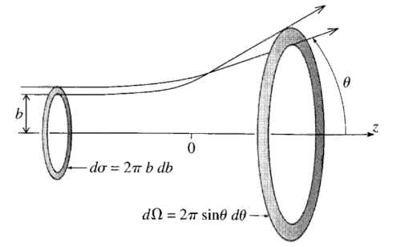

Una de los tres experimentos que se pueden utilizar para estudiar la interacción entre partículas es la dispersión. Clásicamente, este proceso consiste en hacer incidir partículas sobre un potencial, y medir en ángulo con las que estas se dispersan. 

En la siguiente figura se puede observar un esquema de un proceso de dispersión, en el cual las partículas inciden con un *parámetro de impacto* $b$. Estas pasan por una sección diferencial $d\sigma$ y son dispersadas en un ángulo solido $d\Omega$. 

Se define la *sección diferencial transversal* como la relación entre una porción del ángulo solido para el cual la partícula puede emerger luego de la dispersión, con respecto al área con la que estas pueden incidir, y puede expresarse clásicamente como:

$$ \frac{d\sigma}{d\Omega} = \Big| \frac{b}{\text{sen}(\theta)} \frac{d b}{d \theta} \Big| $$

### La regla de oro

Si bien la física clásica nos brinda una noción física del proceso de dispersión de partículas, para describir correctamente este fenómeno es necesario tener en cuenta los efectos cuánticos y relativistas de las partículas. 

Para describir completamente un proceso de dispersión, se requiere de conocer:

* **La amplitud de scattering**: La amplitud $\mathcal{M}$ es una cantidad matemática que describe la probabilidad de que una cierta interacción ocurra entre partículas entrantes y salientes. 

* **El espacio de fases disponible**: Es decir, el conjunto de estados finales accesibles que satisfacen las condiciones de conservación de energía y momento del proceso. 

La amplitud contiene toda la información dinámica del sistema y se halla evaluando los correspondientes *diagramas de Feynman*, y sus correspondientes reglas para la interacción entre las partículas. Por otra parte el espacio de fases contiene la información cinemática para describir el proceso. 

El ritual para calcular la sección transversal de un proceso de dispersión se denomina *regla de oro*, y para dos partículas $1, 2$ colisionando y produciendo partículas $3, 4, ..., n$ se  describe como:

$$ 
\begin{aligned}
\sigma = \frac{\hbar^2 S}{4\sqrt{(p_1 \cdot p_2)^2 - (m_1 m_2 c^2)^2}} \int (2\pi)^4|\mathcal{M}|^2 \delta^4(p_1 + p_2 - p_3 - ...-p_n) \\ \times \prod_{j=3}^N 2\pi \delta(p_j^2 - m_j^2c^2)\theta(p^0_j) \frac{d^4p_j}{(2\pi)^4}
\end{aligned}
$$

### Ejemplo

#### Colisión de dos partículas 

Supongamos el proceso $1 + 2 \rightarrow 3 + 4$ visto desde el centro de masa, es decir $\vec{p}_1 = - \vec{p}_2 = \vec{p}_i$, hallemos la constante $\sqrt{(p_1 \cdot p_2)^2 - (m_1 m_2 c^2)^2}$. Notemos que:

$$ 
p_1 \cdot p_2 = (\frac{E_1}{c}, \vec{p}_i)\cdot(\frac{E_2}{c},-\vec{p}_i) = \frac{E_1 E_2}{c^2} + |\vec{p}_i|^2 = \sqrt{|\vec{p}_i|^2 + m_1^2c^2}\sqrt{|\vec{p}_i|^2 + m_2^2c^2} + |\vec{p}_i|^2 
$$

$$
(p_1 \cdot p_2)^2 = (|\vec{p}_i|^2 + m_1^2c^2)(|\vec{p}_i|^2 + m_2^2c^2) + |\vec{p}_i|^4 + 2|\vec{p}_i|^2\sqrt{|\vec{p}_i|^2 + m_1^2c^2}\sqrt{|\vec{p}_i|^2 + m_2^2c^2}
$$

$$
(p_1 \cdot p_2)^2 - (m_1 m_2 c^2)^2 = 2|\vec{p}_i|^4 + 2|\vec{p}_i|^2(m_1c^2 + m_2c^2) + 2|\vec{p}_i|^2\frac{E_1 E_2}{c^2} = \left(\frac{E_1 +E_2}{c}\right)^2 |\vec{p}_i|^2
$$

$$
\sqrt{(p_1 \cdot p_2)^2 - (m_1m_2c^2)} = \frac{E_1 + E_2}{c} |\vec{p}_i|
$$

En el primer factor del integrando de la sección transversal, puede escribirse como:

$$
\delta(p_1 + p_2 -p_3-p_4) = \delta(\frac{E_1 + E_2}{c} - p^0_3 - p^4_0) \delta^3(\vec{p}_3 + \vec{p}_4) 
$$

Por otra parte podemos ver que, el segundo factor del integrando puede simplificarse como:

$$ 
\prod_{j=3}^4 2\pi \delta(p_j^2 - m_j^2c^2)\theta(p^0_j) \frac{d^4p}{(2\pi)^4} \rightarrow \frac{\delta(p^0_3 - \sqrt{|\vec{p}_3|^2 + m_3^2 c^2})}{2\sqrt{|\vec{p}_3|^2 + m_3^2 c^2}} \frac{\delta(p^0_4 - \sqrt{|\vec{p}_4|^2 + m_4^2 c^2})}{2\sqrt{|\vec{p}_4|^2 + m_4^2 c^2}} \frac{d^4p_3}{(2\pi)^3} \frac{d^4p_4}{(2\pi)^3}
$$

En donde se utilizo la propiedad de las deltas Dirac $\delta(x^2 - a^2) = \frac{1}{|a|}(\delta(x-a) + \delta(x+a))$. El segundo sumando se puede ignorar debido a que se anula durante la integración ya que la función de Heaviside $\theta(p_j^0)$ evita que $p^0_3$ y $p^0_4$ tomen valores negativos. Reemplazando e integrando ambos factores sobre $dp^0_3$ y $dp_4^0$ obtenemos.

$$ 
\sigma = \frac{\hbar^2 c S (2\pi)^4}{4(E_1 + E_2) |\vec{p}_i|} \int |\mathcal{M}|^2 \frac{\delta(\frac{E_1 +E_2}{c} - \sqrt{|\vec{p}_3|^2 + m_3^2c^2} - \sqrt{|\vec{p}_4|^2 + m_4^2c^2})}{4 \sqrt{|\vec{p}_3|^2 + m_3^2c^2}\sqrt{|\vec{p}_4|^2 + m_4^2c^2}} \delta^3(\vec{p}_3 + \vec{p}_4) \frac{d^3\vec{p}_3}{(2\pi)^3} \frac{d^3\vec{p}_4}{(2\pi)^3} 
$$

Definiendo $\vec{p}_3 = \vec{p}_f$, integrando sobre $d^3\vec{p}_4$, los momentos de la partícula $4$ resultan $\vec{p}_4 = -\vec{p}_f$ debido a la delta Dirac $\delta^3(\vec{p}_3 + \vec{p}_4)$. Tomando $u = \sqrt{|\vec{p}_f|^2 + m_3^2c^2} - \sqrt{|\vec{p}_f|^2 + m_4^2c^2}$  la integral queda como:

$$ 
\sigma = \left(\frac{\hbar c}{8\pi}\right)^2 \frac{S}{c(E_1 + E_2) |\vec{p}_i|} \int 
|\mathcal{M}|^2\frac{\delta(\frac{E_1 + E_2}{c} - u)}{\sqrt{|\vec{p}_f|^2 + m_3^2c^2}\sqrt{|\vec{p}_f|^2 + m_4^2c^2}} d^3\vec{p}_f
$$

Dicha integral no se puede calcular directamente sin conocer la amplitud $\mathcal{M}$, ya que esta tiene dependencia en el ángulo solido $\Omega$ del espacio de fases en el cual se esta integrando. Sin embargo nos interesa la sección transversal diferencial, por lo que se puede derivar ambos miembros por $\Omega$, de esta forma solo se integrara a lo largo de la componente radial momento $\vec{p}_f$, es decir $p^2 dp$.

Por otra parte derivando $u$ por la componente radial del momento $|\vec{p}_f| = p$, obtenemos:

$$
\frac{du}{dp} = \frac{p}{\sqrt{p^2 + m_3^2c^2}} + \frac{p}{\sqrt{p|^2 + m_4^2c^2}} = \frac{pu}{\sqrt{p^2 + m_3^2c^2} \sqrt{p^2 + m_4^2c^2}}
$$

Haciendo cambio de variables en la integral:

$$ 
\frac{d\sigma}{d\Omega} = \left(\frac{\hbar c}{8\pi}\right)^2 \frac{S}{c(E_1 + E_2) |\vec{p}_i|} \int 
|\mathcal{M}|^2 \delta(\frac{E_1 + E_2}{c} - u) \frac{p}{u} du
$$

Obteniéndose finalmente:

$$
\frac{d\sigma}{d\Omega} = \left(\frac{\hbar c}{8\pi}\right)^2 \frac{S |\mathcal{M}|^2}{(E_1 + E_2)^2} \frac{|\vec{p}_f|}{|\vec{p}_i|}
$$

En donde la magnitud del momento resultante se puede hallar de la relación de $u$ con las energías:  

$$
\frac{E_1 + E_2}{c} = \sqrt{|\vec{p}_f|^2 + m_3^2c^2} - \sqrt{|\vec{p}_f|^2 + m_4^2c^2}
$$

### Ejemplos

#### Dispersión con partícula masiva

Consideremos el proceso elástico $a + b \rightarrow a + b$, con la partícula $b$ en reposo.  Asumiendo que la partícula $b$ es masiva ($M c^2 >> E_a$ con $M$ la masa de $b$ y $m$ la masa de $a$) de modo que no se mueve luego de desviar a la partícula $a$, hallemos la sección diferencial transversal.

Hallemos la constante $\sqrt{(p_1 \cdot p_2)^2 - (m M c^2)^2}$. Notemos que:

$$ p_1 \cdot p_2 = (\frac{E_1}{c}, \vec{p}_1)\cdot(\frac{E_2}{c},0) = \frac{E_1 E_2}{c^2} = \sqrt{|\vec{p}_1|^2 + m^2c^2} Mc$$

$$ (p_1 \cdot p_2)^2 = |\vec{p}_1|^2 M^2c^2 + m^2M^2c^4$$

$$
\sqrt{(p_1 \cdot p_2)^2 - m^2M^2c^4} = |\vec{p}_1| Mc
$$

Notemos que la condición $m_b c^2 >> E_a$ implica que el marco de referencia del centro de masa y el de laboratorio son iguales.  En el primer factor del integrando de la sección transversal, puede escribirse como:

$$ \delta(p_1 + p_2 -p_3-p_4) = \delta(\frac{E_1}{c} + Mc - p^0_3 - p^0_4) \delta^3(\vec{p}_1 - \vec{p}_3) $$

El segundo factor como:

$$ 
\prod_{j=3}^4 2\pi \delta(p_j^2 - m_j^2c^2)\theta(p^0_j) \frac{d^4p}{(2\pi)^4} \rightarrow \frac{\delta(p^0_3 - \sqrt{|\vec{p}_3|^2 + m^2 c^2})}{2\sqrt{|\vec{p}_3|^2 + m^2 c^2}} \frac{\delta(p^0_4 -  M c)}{2 M c} \frac{d^4p_3}{(2\pi)^3} \frac{d^4p_4}{(2\pi)^3}
$$

Reemplazando en la sección transversal:

$$ 
\sigma = \frac{\hbar S (2\pi)^4}{4 Mc |\vec{p}_1|} \int |\mathcal{M}|^2 \frac{\delta(\frac{E_1}{c} - \sqrt{|\vec{p}_3|^2 + m^2c^2} + Mc - p^0_4)}{4 \sqrt{|\vec{p}_3|^2 + m^2c^2}Mc} \delta^3(\vec{p}_1 - \vec{p}_3) \frac{d^3\vec{p}_3}{(2\pi)^3} \frac{d^3\vec{p}_4}{(2\pi)^3} 
$$

Derivando con respecto al ángulo solido $\Omega$ y tomando $u= \sqrt{|\vec{p}_3|^2 + m^2 c^2} = \sqrt{p^2 + m^2 c^2}$ , derivando $\frac{du}{dp} = \frac{p}{u}$:

$$
\frac{d\sigma}{d\Omega} = \left(\frac{c\hbar}{8\pi}\right)^2 \frac{S  |\mathcal{M}|^2}{Mc |\vec{p}|} \int \frac{\delta(\frac{E_1}{c} - u)}{Mc}pdu 
$$

Finalmente, dado a que las partículas dispersadas son distinguibles $S=1$, luego la sección transversal diferencial será: 

$$\frac{d\sigma}{d\Omega} = \left(\frac{c\hbar}{8\pi Mc}\right)^2  |\mathcal{M}|^2$$

Nótese que este resultado no depende del $3$-momento de la partícula que se dispersa.  

#### Aniquilación de partículas

Consideremos el proceso $1 + 2 \rightarrow 3 + 4$ en el marco de referencia del laboratorio, con la partícula $2$ en reposo y con las partículas $3$ y $4$ sin masa. Hallemos la constante $\sqrt{(p_1 \cdot p_2)^2 - (m M c^2)^2}$. 

$$ p_1 \cdot p_2 = (\frac{E_1}{c}, \vec{p}_1)\cdot(\frac{E_2}{c},0) = \frac{E_1 E_2}{c^2} = \sqrt{|\vec{p}_1|^2 + m_1^2c^2} m_2c$$

$$
\sqrt{(p_1 \cdot p_2)^2 - m_1^2m_2^2c^4} = |\vec{p}_1| m_2c
$$

En el primer factor del integrando de la sección transversal, puede escribirse como:

$$ 
\delta(p_1 + p_2 -p_3-p_4) = \delta(\frac{E_1}{c} + m_2c - p^0_3 - p^0_4) \delta^3(\vec{p}_1 - \vec{p}_3 - \vec{p}_4)
$$

El segundo factor puede escribirse como:

$$ 
\prod_{j=3}^4 2\pi \delta(p_j^2 - m_j^2c^2)\theta(p^0_j) \frac{d^4p}{(2\pi)^4} \rightarrow \frac{\delta(p^0_3 - |\vec{p}_3|)}{2|\vec{p}_3|^2 } \frac{\delta(p^0_4 - |\vec{p}_4|)}{2|\vec{p}_4|}\frac{d^4p_3}{(2\pi)^3} \frac{d^4p_4}{(2\pi)^3}
$$

Reemplazando en la expresión de la sección transversal:

$$ 
\sigma = \frac{\hbar c S (2\pi)^4}{4 m_2c |\vec{p}_1|} \int |\mathcal{M}|^2 \frac{\delta(\frac{E_1 +E_2}{c} - |\vec{p}_3| - |\vec{p}_4|)}{4 |\vec{p}_3|   |\vec{p}_4|} \delta^3(\vec{p}_1 - \vec{p}_3 - \vec{p}_4) \frac{d^3\vec{p}_3}{(2\pi)^3} \frac{d^3\vec{p}_4}{(2\pi)^3} 
$$

Derivando con respecto al ángulo solido:

$$ 
\frac{d\sigma}{d\Omega} = \left( \frac{\hbar c}{8\pi} \right)^2 \frac{S}{ m_2c |\vec{p}_1|} \int |\mathcal{M}|^2 \frac{\delta(\frac{E_1}{c} + m_2c - |\vec{p}_3| - |\vec{p}_4|)}{|\vec{p}_3|   |\vec{p}_4|} \delta^3(\vec{p}_1 - \vec{p}_3 - \vec{p}_4)  d^3\vec{p}_3d^3\vec{p}_4  
$$

Notemos que al integrar sobre $\vec{p}_4$ , la delta Dirac $\delta^3(\vec{p}_1 - \vec{p}_3 - \vec{p}_4)$ hace que $\vec{p}_4 = \vec{p}_1 - \vec{p}_3$, luego, si la partícula $3$ sale dispersada con un ángulo $\theta$, entonces:

$$ 
\frac{d\sigma}{d\Omega} = \left( \frac{\hbar c}{8\pi} \right)^2 \frac{S}{ m_2c |\vec{p}_1|} \int |\mathcal{M}|^2 \frac{\delta(\frac{E_1}{c} + m_2c - |\vec{p}_3| - |\vec{p}_1 - \vec{p}_3|)}{|\vec{p}_3||\vec{p}_1 - \vec{p}_3|}  d^3\vec{p}_3
$$

Tomando $u$ como:

$$ 
u = |\vec{p}_3| + |\vec{p}_1 - \vec{p}_3|  =  |\vec{p}_3| + \sqrt{|\vec{p}_1|^2 + |\vec{p}_3|^2 - 2|\vec{p}_1||\vec{p}_3| \cos\theta} = p + \sqrt{|\vec{p}_1|^2 +p^2 - 2|\vec{p}_1|p \cos\theta}
$$

$$
\frac{du}{dp} = 1 + \frac{p - |\vec{p}_1|\cos\theta}{\sqrt{|\vec{p}_1|^2 +p^2 - 2|\vec{p}_1|p \cos\theta}} = \frac{u - |\vec{p}_1|\cos\theta}{\sqrt{|\vec{p}_1|^2 +p^2 - 2|\vec{p}_1|p \cos\theta}}
$$

Reemplazando:

$$
\frac{d\sigma}{d\Omega} = \left(\frac{\hbar}{8\pi}\right)^2 \frac{S  |\mathcal{M}|^2}{m_2c |\vec{p}_1|} \int \frac{\delta(\frac{E_1}{c} + m_2c - u)}{p\sqrt{|\vec{p}_1|^2 +p^2 - 2|\vec{p}_1|p \cos\theta}}p^2dp 
$$

Haciendo el cambio de variable de integración:

$$
\frac{d\sigma}{d\Omega} = \left(\frac{\hbar}{8\pi}\right)^2 \frac{S  |\mathcal{M}|^2}{m_2c |\vec{p}_1|} \int \frac{\delta(\frac{E_1}{c} + m_2c - u)}{u - |\vec{p}_1|\cos\theta}pdu 
$$

Finalmente, integrando sobre $u$, obtenemos la expresión para la sección transversal diferencial. 

$$
\frac{d\sigma}{d\Omega} = \left(\frac{\hbar}{8\pi}\right)^2 \frac{S  |\mathcal{M}|^2}{m_2 |\vec{p}_1|}  \frac{ |\vec{p}_3|}{E_1 + m_2c^2 - |\vec{p}_1|c\cos\theta}
$$